Docker client is the tool used to issue commands (docker cli)  
Docker server is responsible for creating images, containers (docker daemon)  
Docker hub is like GitHub having free images  
  
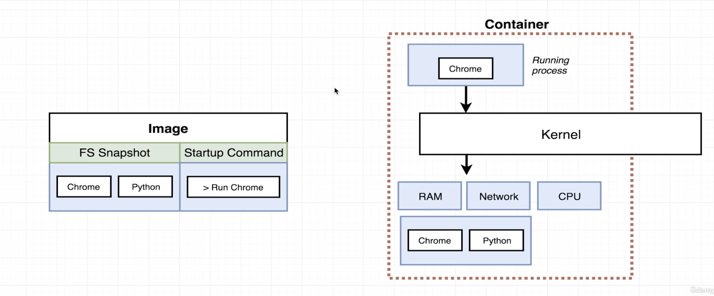  
  
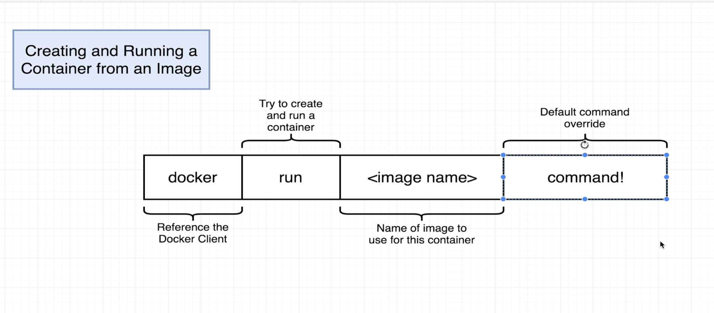  
  
  
* Docker ps- to list all the running containers  
* Docker ps—all - to list all the containers that were created  
* Docker run= docker create +docker start  
* When we do docker create it gives the id of the container created on the terminal and the same outputs if we give “docker start id” so we need to give ‘docker start -a id’ to get the output on the terminal  
* Docker system prune- delete all the containers that were present  
* Docker logs id- to print all the logs that were there even in the closed containers   
* Docker stop and docker kill is used to terminate a running container but there is diff stop is graceful shutdown whereas kill is aggressive  
* Docker exec used to execute additional command in a container  
* Docker exec -i and -t together -I means attach to standard in of cli -t makes it pretty (format)  
* Docker run -it busy box sh - to go into shell mode  
  
  
  
* 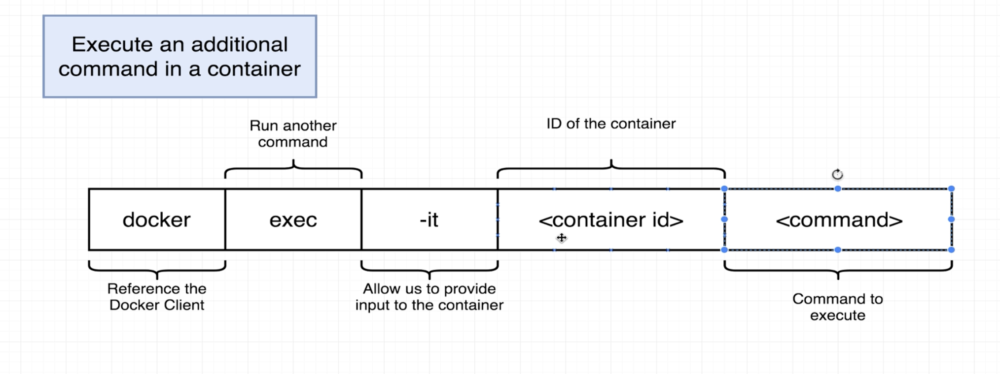  
  
* 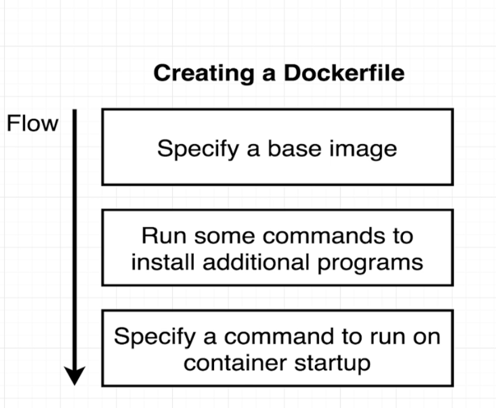  
* 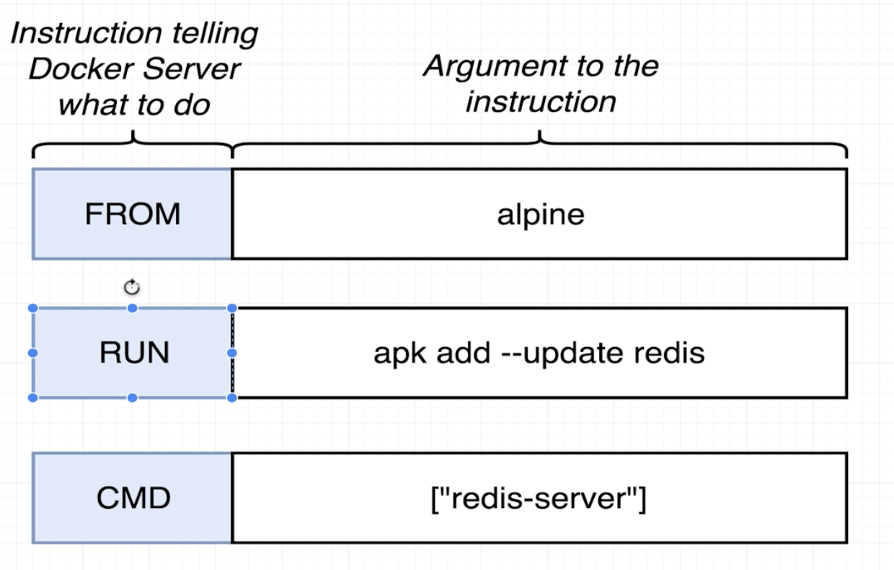  
  
  
* Docker build is like compiling the text written in Dockerfile to make it like a ready frozen meal which can be run later  
* Inorder to tag an image we use “docker build -t sujanmd/redis-server:latest .”. Once this is done we can just run docker run sujanmd/redis-server  
  
  
To do port mapping we use “docker run -p 8080:8080 image name”  
  
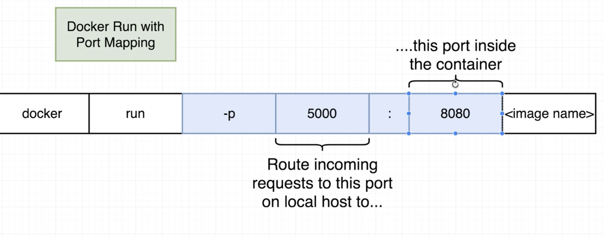  
  
  
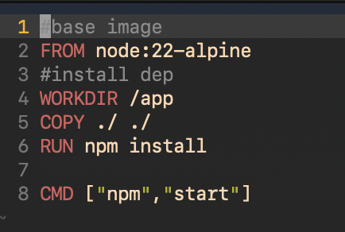  
  
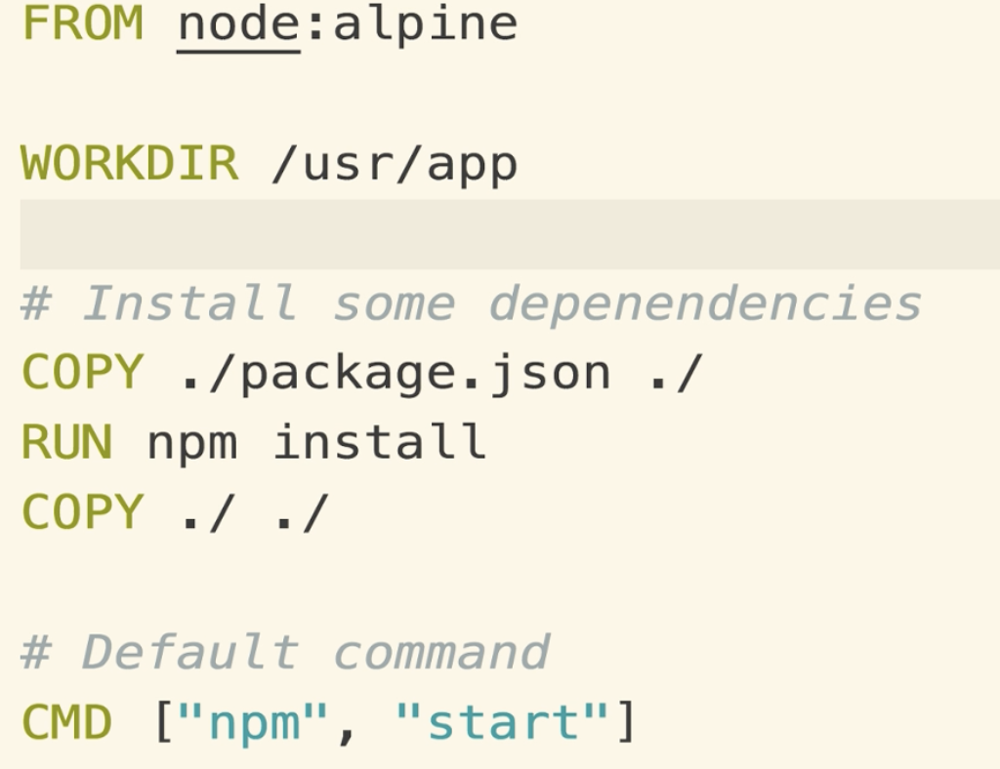  
Here the first copy line says that the package.json file is in the local Mac system and is copied to the container workspace and the second copy says that the remaining codes that are there in the local folder is copied   
  
  
* Docker save is used to package a docker file into a .tar archive  
* Docker load is used to do the reverse of docker save or simply unpack the tarball  
* Docker export on the other hand targets a container and takes a snapshot of the current filesystem into .tar file  
Transfer can be done using scp itself or using any ftp agent   
  
  
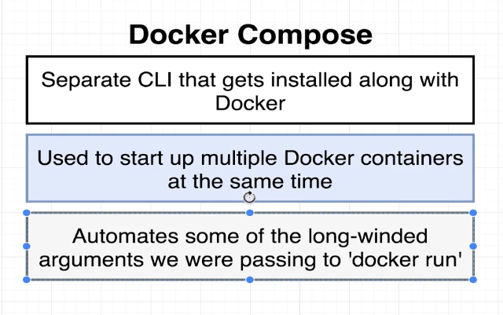  
  
- In yaml file is used to specify array   
* Docker compose is used to remove the work of specifying long docker run commands and also gives the option of communication between multiple containers  
* Docker-compose up is used to run an image that is already present whereas docker-compose up —build is used to freshly rebuild the image and then run it  
* 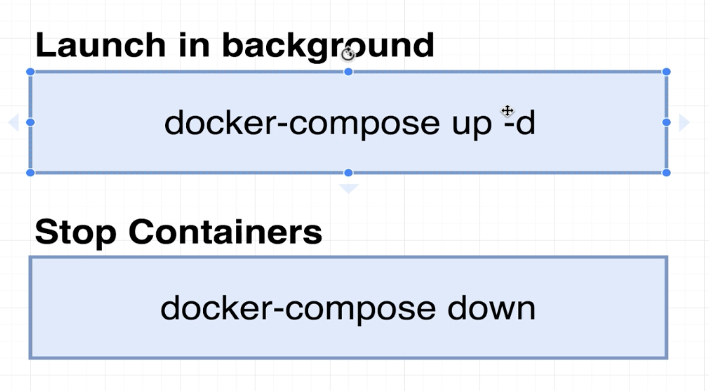  
  
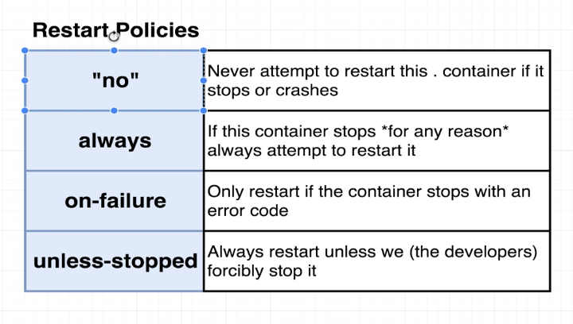  
  
* If in case a container fails and we want to restart it there are these restart policies  and the code is written in docker-compose file   
* Use -d flag for detached mode so that the container is built in the background and the cli can be used   
* 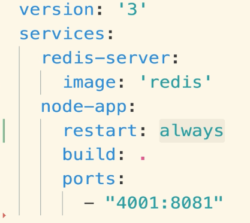  
  
* When we want hot reload we use Dockerfile.dev  
* 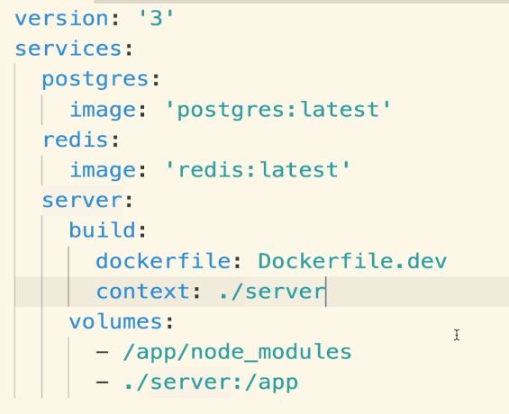  
  
HERE, the second line with the colon says that copy everything inside the server folder to the container workspace except the node_modules which is specified in the first line.  
* The Postgres and redis services don’t have build because they just pull the image from dockerhub and run it directly  
* Context is used to specify the code directory   
* Volumes is expected to have a list format so - is used before  
  
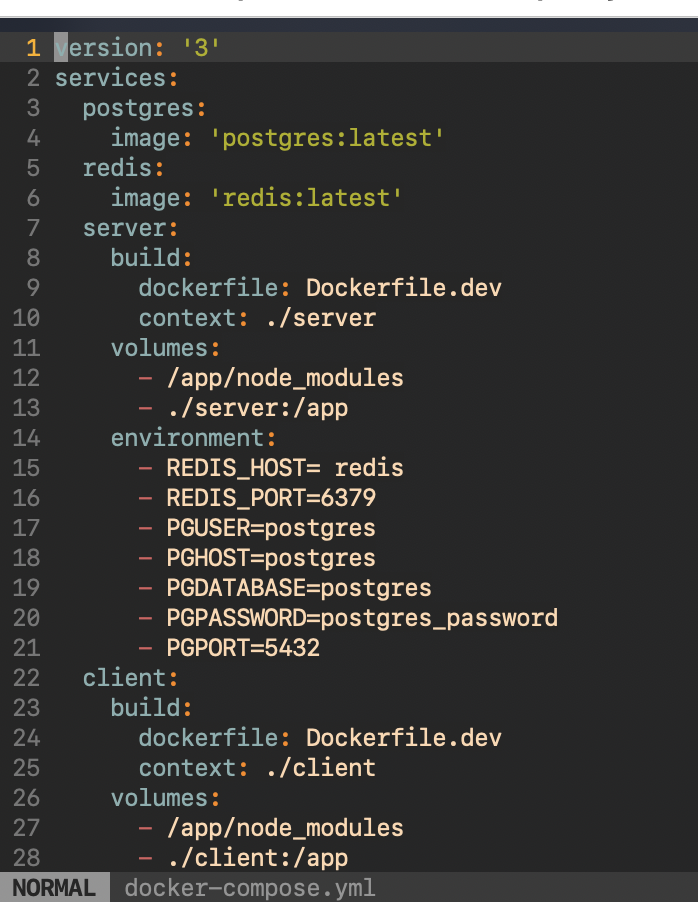  
  
* Nginx is used as a reverse proxy , it is a web server. It is used to map the endpoint calls to the server efficiently. Like if the call request has /api/ then it redirects to the express server or else to the react server  
